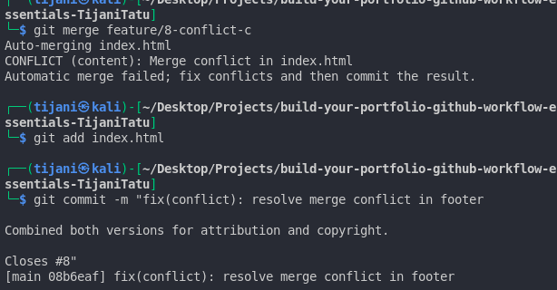

# 🌐 Personal Portfolio Documentation

---

## 1. Student Details

- **Full Name**: Tijani Tatu  
- **Admission Number** : 150397
- **GitHub Username**: [TijaniTatu](https://github.com/TijaniTatu)  
- **School Email**:tijani.tatu@strathmore.edu
- **Github Email**: riekotijani@gmail.com

---

## 2. Deployed Portfolio Link

- **GitHub Pages URL**: [https://is-project-4th-year.github.io/build-your-portfolio-github-workflow-essentials-TijaniTatu/](https://is-project-4th-year.github.io/build-your-portfolio-github-workflow-essentials-TijaniTatu/)

---

## 3. Learnings from the Git Crash Program

- **Branching**: Allowed me to develop each feature independently and avoid affecting the main codebase. Each feature or fix lived in its own branch until it was ready to merge.

- **Commit Conventions**: Using structured commit messages helped keep my history organized and readable. For example, I used `feat`, `fix`, `style`, `chore`, etc., based on the type of change.

- **Pull Requests**: Helped me track each feature and link it back to an issue. Also let me test changes before merging into the main code.

- **Merge Conflict Resolution**: I simulated and resolved a conflict between two branches that modified the same part of the footer — learning how to manually merge code.

---

## 4. Screenshots of Key GitHub Features

### A. Milestones and Issues

### B. Project Board

### C. Branching

### D. Pull Requests

### E. Merge Conflict Resolution

#### solved merge conflict

---

## 5. Commit Convention Samples

Here are six different commit types I used:

- `feat(portfolio): add layout for landing page`
- `style(contact): apply background and spacing to contact section`
- `fix(conflict): resolve merge conflict in footer`
- `docs(readme): add deployed link to Assignment.md`
- `refactor(projects): simplify project card structure`
- `chore(gitignore): ignore backup and build files`

---

## 6. Pull Request Summary

| Branch Name | PR Title | Issue Closed |
|-------------|----------|--------------|
| `feature/3-style-header-tagline` | Style header and tagline | #3 |
| `feature/4-project-cards` | Add project card layout | #4 |
| `feature/5-project-links` | Add GitHub links to projects | #5 |
| `feature/6-style-contact` | Style contact section | #6 |
| `chore/7-enable-gh-pages` | Enable GitHub Pages | #7 |
| `feature/8-conflict-b` | Simulated and resolved footer merge conflict | #8 |

---

## ✅ Submission Checklist

- [✅] Defined milestones for key features  
- [✅] Created and linked issues to milestones  
- [✅] Organized a GitHub project board (To Do / In Progress / Done)  
- [✅] Used structured commit messages  
- [✅] Created separate feature branches for tasks  
- [✅] Opened and merged PRs with meaningful descriptions  
- [✅] Demonstrated conflict resolution (see PR for #8)  
- [✅] Deployed the portfolio online  
- [✅] Completed and updated this Assignment.md file

---

